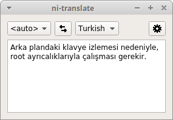

Because of the background keyboard watching, it needs to run with root privileges.\
It also needs python3 in PATH to run.

Build Steps:

Install qmake and base Qt 5 development files:\
`sudo apt-get install qt5-default`

Create a folder for build files and `cd` into it.\
Run this from your folder:\
`qmake <project_files_folder>/ni-translate.pro -spec linux-g++`\
This should have extracted Makefile in your build folder. Run `make` there.\
Copy language_list, translate.py files and googletrans folder into your build folder.

Google Translate part credit:\
https://github.com/ssut/py-googletrans
